# TwfAiFramework — System Diagrams

This document provides visual diagrams of the TwfAiFramework architecture, request flows, execution flows, and other key system interactions using Mermaid.

---

## Table of Contents

1. [System Architecture](#1-system-architecture)
2. [Request Flow](#2-request-flow)
3. [Execution Flow](#3-execution-flow)
4. [Node Execution Lifecycle](#4-node-execution-lifecycle)
5. [Data Flow](#5-data-flow)
6. [Error Handling Flow](#6-error-handling-flow)
7. [Parallel Execution Flow](#7-parallel-execution-flow)
8. [Loop Execution Flow](#8-loop-execution-flow)
9. [Branch Execution Flow](#9-branch-execution-flow)
10. [LLM Integration Flow](#10-llm-integration-flow)
11. [RAG Pipeline Flow](#11-rag-pipeline-flow)
12. [Retry Mechanism Flow](#12-retry-mechanism-flow)
13. [State Management](#13-state-management)
14. [Class Hierarchy](#14-class-hierarchy)

---

## 1. System Architecture

### High-Level Architecture

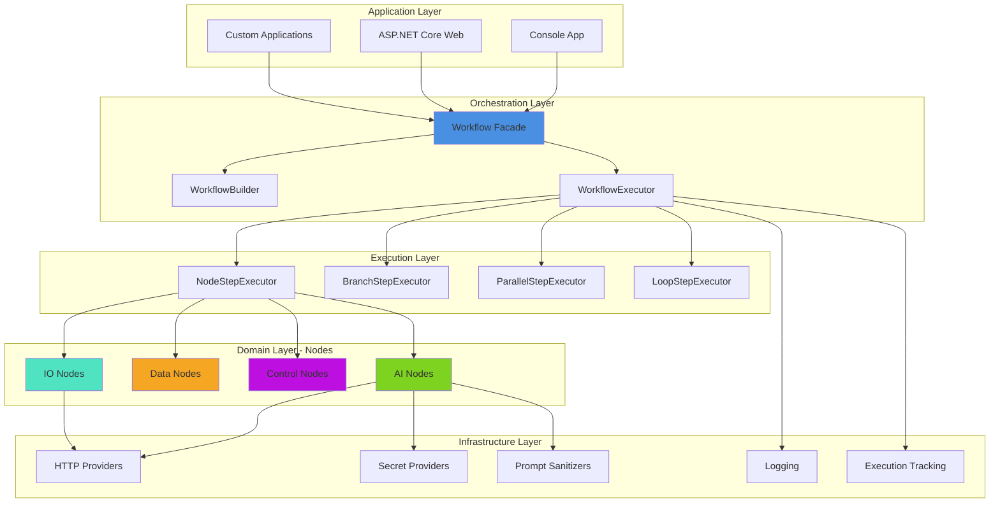
```mermaid
graph TB
 subgraph "Application Layer"
     Console[Console App]
        Web[ASP.NET Core Web]
      Custom[Custom Applications]
end
    
    subgraph "Orchestration Layer"
        Workflow[Workflow Facade]
        Builder[WorkflowBuilder]
        Executor[WorkflowExecutor]
    end
    
    subgraph "Execution Layer"
        NodeExec[NodeStepExecutor]
    BranchExec[BranchStepExecutor]
      ParallelExec[ParallelStepExecutor]
        LoopExec[LoopStepExecutor]
    end
    
    subgraph "Domain Layer - Nodes"
        AI[AI Nodes]
        Data[Data Nodes]
        Control[Control Nodes]
   IO[IO Nodes]
    end
    
    subgraph "Infrastructure Layer"
 HTTP[HTTP Providers]
     Secrets[Secret Providers]
        Sanitization[Prompt Sanitizers]
  Logging[Logging]
        Tracking[Execution Tracking]
    end
    
    Console --> Workflow
    Web --> Workflow
    Custom --> Workflow
    
    Workflow --> Builder
    Workflow --> Executor
    
    Executor --> NodeExec
    Executor --> BranchExec
    Executor --> ParallelExec
    Executor --> LoopExec
    
    NodeExec --> AI
    NodeExec --> Data
    NodeExec --> Control
    NodeExec --> IO
    
    AI --> HTTP
    AI --> Secrets
    AI --> Sanitization
    IO --> HTTP
    
    Executor --> Logging
    Executor --> Tracking
    
    style Workflow fill:#4A90E2
    style AI fill:#7ED321
    style Data fill:#F5A623
 style Control fill:#BD10E0
    style IO fill:#50E3C2
```

### Layer Responsibilities

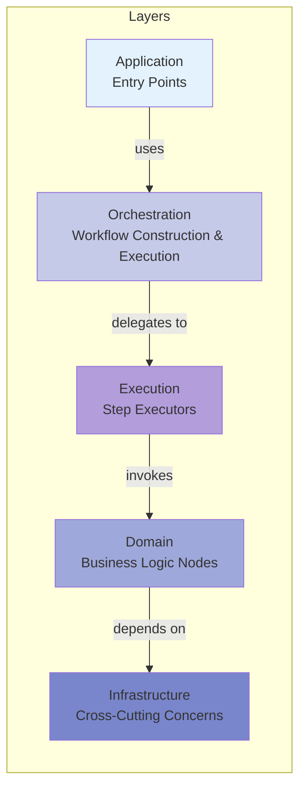
```mermaid
graph LR
    subgraph "Layers"
    A[Application<br/>Entry Points] 
  O[Orchestration<br/>Workflow Construction & Execution]
        E[Execution<br/>Step Executors]
        D[Domain<br/>Business Logic Nodes]
  I[Infrastructure<br/>Cross-Cutting Concerns]
    end
    
    A -->|uses| O
    O -->|delegates to| E
    E -->|invokes| D
    D -->|depends on| I
    
    style A fill:#E3F2FD
    style O fill:#C5CAE9
    style E fill:#B39DDB
    style D fill:#9FA8DA
    style I fill:#7986CB
```

---

## 2. Request Flow

### API Request to Workflow Execution

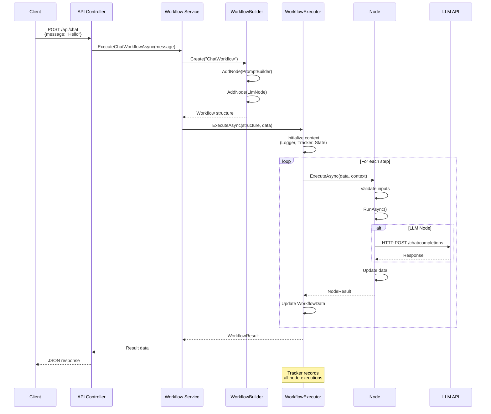
```mermaid
sequenceDiagram
    participant Client
    participant API as API Controller
    participant Service as Workflow Service
    participant Builder as WorkflowBuilder
    participant Executor as WorkflowExecutor
    participant Node as Node
participant LLM as LLM API
    
    Client->>API: POST /api/chat<br/>{message: "Hello"}
    API->>Service: ExecuteChatWorkflowAsync(message)
  
    Service->>Builder: Create("ChatWorkflow")
    Builder->>Builder: AddNode(PromptBuilder)
    Builder->>Builder: AddNode(LlmNode)
    Builder-->>Service: Workflow structure
    
    Service->>Executor: ExecuteAsync(structure, data)
    
    Executor->>Executor: Initialize context<br/>(Logger, Tracker, State)
    
    loop For each step
        Executor->>Node: ExecuteAsync(data, context)
        Node->>Node: Validate inputs
        Node->>Node: RunAsync()

        alt LLM Node
     Node->>LLM: HTTP POST /chat/completions
            LLM-->>Node: Response
        end
 
  Node->>Node: Update data
        Node-->>Executor: NodeResult
 Executor->>Executor: Update WorkflowData
    end
    
    Executor-->>Service: WorkflowResult
    Service-->>API: Result data
    API-->>Client: JSON response
    
    Note over Executor: Tracker records<br/>all node executions
```

### Designer Workflow Execution

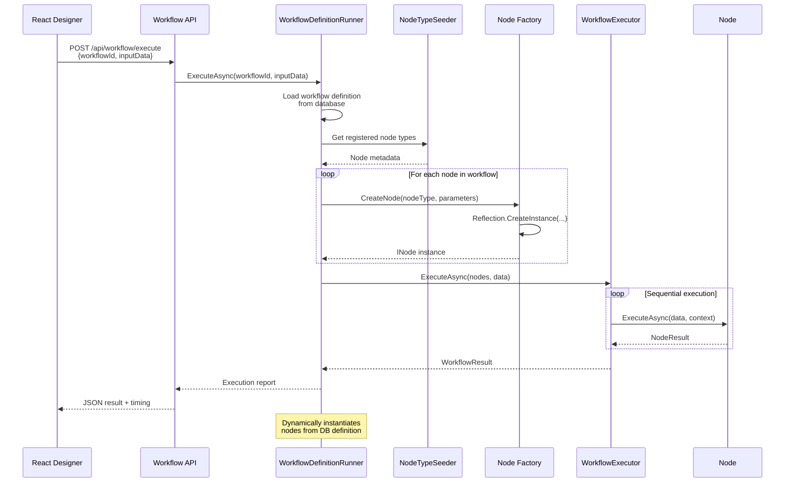
```mermaid
sequenceDiagram
    participant UI as React Designer
    participant API as Workflow API
    participant Runner as WorkflowDefinitionRunner
    participant Seeder as NodeTypeSeeder
    participant Factory as Node Factory
  participant Executor as WorkflowExecutor
    participant Node
    
    UI->>API: POST /api/workflow/execute<br/>{workflowId, inputData}
    API->>Runner: ExecuteAsync(workflowId, inputData)
    
    Runner->>Runner: Load workflow definition<br/>from database
    
    Runner->>Seeder: Get registered node types
    Seeder-->>Runner: Node metadata
    
    loop For each node in workflow
      Runner->>Factory: CreateNode(nodeType, parameters)
        Factory->>Factory: Reflection.CreateInstance(...)
        Factory-->>Runner: INode instance
    end
    
    Runner->>Executor: ExecuteAsync(nodes, data)
    
    loop Sequential execution
    Executor->>Node: ExecuteAsync(data, context)
        Node-->>Executor: NodeResult
    end
    
    Executor-->>Runner: WorkflowResult
    Runner-->>API: Execution report
    API-->>UI: JSON result + timing
    
    Note over Runner: Dynamically instantiates<br/>nodes from DB definition
```

---

## 3. Execution Flow

### Workflow Execution Pipeline

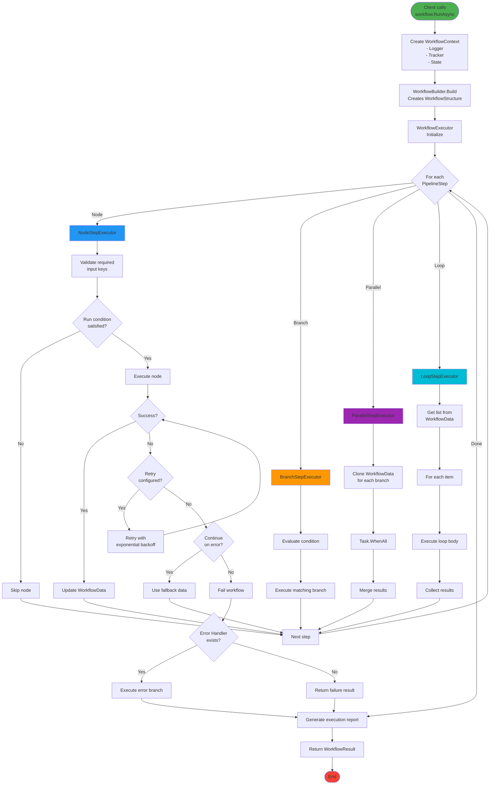
```mermaid
flowchart TD
    Start([Client calls<br/>workflow.RunAsync]) --> CreateContext[Create WorkflowContext<br/>- Logger<br/>- Tracker<br/>- State]
    CreateContext --> BuildStructure[WorkflowBuilder.Build<br/>Creates WorkflowStructure]
    BuildStructure --> InitExecutor[WorkflowExecutor<br/>Initialize]
    
    InitExecutor --> LoopSteps{For each<br/>PipelineStep}
    
    LoopSteps -->|Node| NodeExec[NodeStepExecutor]
    LoopSteps -->|Branch| BranchExec[BranchStepExecutor]
    LoopSteps -->|Parallel| ParallelExec[ParallelStepExecutor]
    LoopSteps -->|Loop| LoopExec[LoopStepExecutor]
    
    NodeExec --> ValidateInputs[Validate required<br/>input keys]
    ValidateInputs --> CheckCondition{Run condition<br/>satisfied?}
    CheckCondition -->|No| SkipNode[Skip node]
    CheckCondition -->|Yes| ExecuteNode[Execute node]
    
    ExecuteNode --> NodeSuccess{Success?}
    NodeSuccess -->|Yes| UpdateData[Update WorkflowData]
    NodeSuccess -->|No| CheckRetry{Retry<br/>configured?}
    
 CheckRetry -->|Yes| RetryNode[Retry with<br/>exponential backoff]
    CheckRetry -->|No| CheckContinue{Continue<br/>on error?}
    
    CheckContinue -->|Yes| UseFallback[Use fallback data]
    CheckContinue -->|No| FailWorkflow[Fail workflow]
    
    RetryNode --> NodeSuccess
    SkipNode --> NextStep
    UpdateData --> NextStep[Next step]
    UseFallback --> NextStep
    
    BranchExec --> EvalCondition[Evaluate condition]
    EvalCondition --> ExecuteBranch[Execute matching branch]
    ExecuteBranch --> NextStep
    
    ParallelExec --> CloneData[Clone WorkflowData<br/>for each branch]
    CloneData --> RunParallel[Task.WhenAll]
    RunParallel --> MergeResults[Merge results]
    MergeResults --> NextStep
    
    LoopExec --> GetItems[Get list from<br/>WorkflowData]
    GetItems --> ForEachItem[For each item]
    ForEachItem --> RunLoopBody[Execute loop body]
    RunLoopBody --> CollectResults[Collect results]
    CollectResults --> NextStep
    
    NextStep --> LoopSteps
    LoopSteps -->|Done| GenerateReport[Generate execution report]
    GenerateReport --> ReturnResult[Return WorkflowResult]
    
    FailWorkflow --> ErrorHandler{Error Handler<br/>exists?}
    ErrorHandler -->|Yes| ExecuteErrorHandler[Execute error branch]
    ErrorHandler -->|No| ReturnFailure[Return failure result]
    ExecuteErrorHandler --> GenerateReport
    ReturnFailure --> GenerateReport
    
    ReturnResult --> End([End])
    
    style Start fill:#4CAF50
    style End fill:#F44336
    style NodeExec fill:#2196F3
    style BranchExec fill:#FF9800
    style ParallelExec fill:#9C27B0
style LoopExec fill:#00BCD4
```

---

## 4. Node Execution Lifecycle

### BaseNode Template Method Pattern

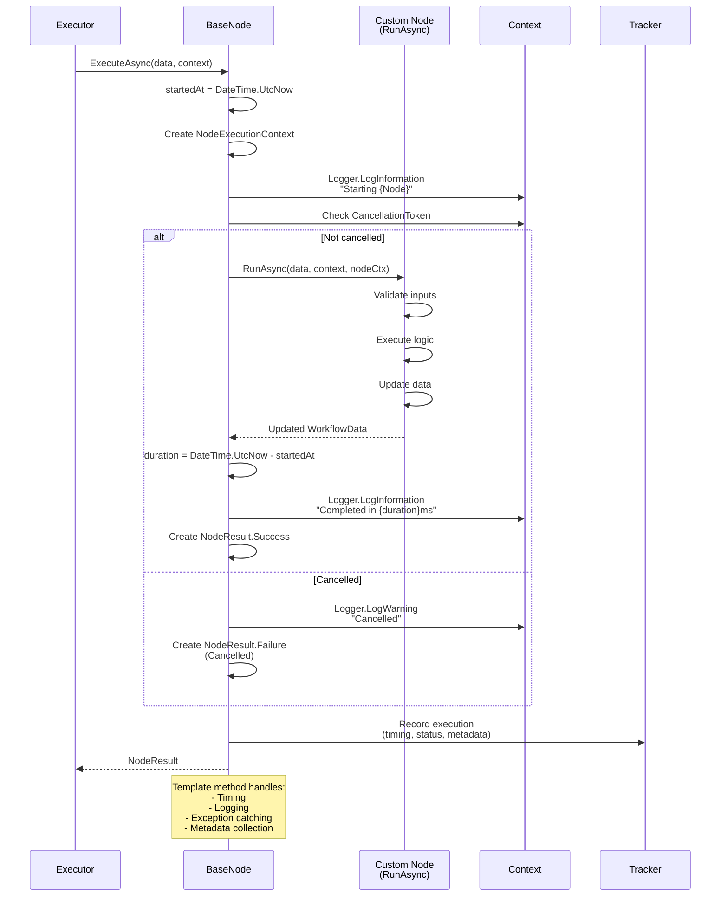
```mermaid
sequenceDiagram
participant Executor
    participant BaseNode
    participant CustomNode as Custom Node<br/>(RunAsync)
    participant Context
  participant Tracker
  
    Executor->>BaseNode: ExecuteAsync(data, context)
    
    BaseNode->>BaseNode: startedAt = DateTime.UtcNow
    BaseNode->>BaseNode: Create NodeExecutionContext
  
    BaseNode->>Context: Logger.LogInformation<br/>"Starting {Node}"
    
    BaseNode->>Context: Check CancellationToken
    
    alt Not cancelled
        BaseNode->>CustomNode: RunAsync(data, context, nodeCtx)
        
   CustomNode->>CustomNode: Validate inputs
        CustomNode->>CustomNode: Execute logic
   CustomNode->>CustomNode: Update data
        
        CustomNode-->>BaseNode: Updated WorkflowData
        
        BaseNode->>BaseNode: duration = DateTime.UtcNow - startedAt
        BaseNode->>Context: Logger.LogInformation<br/>"Completed in {duration}ms"
        
        BaseNode->>BaseNode: Create NodeResult.Success
    else Cancelled
        BaseNode->>Context: Logger.LogWarning<br/>"Cancelled"
        BaseNode->>BaseNode: Create NodeResult.Failure<br/>(Cancelled)
    end
    
    BaseNode->>Tracker: Record execution<br/>(timing, status, metadata)
    
    BaseNode-->>Executor: NodeResult
    
    Note over BaseNode: Template method handles:<br/>- Timing<br/>- Logging<br/>- Exception catching<br/>- Metadata collection
```

### Node Execution with Retry

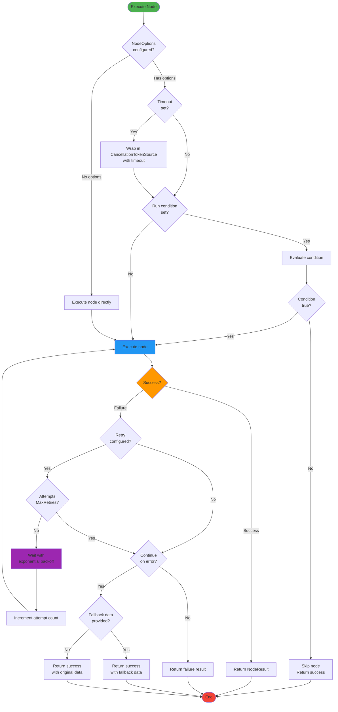
```mermaid
flowchart TD
    Start([Execute Node]) --> CheckOptions{NodeOptions<br/>configured?}
    
    CheckOptions -->|No options| DirectExecute[Execute node directly]
    CheckOptions -->|Has options| CheckTimeout{Timeout<br/>set?}
    
    CheckTimeout -->|Yes| WrapTimeout[Wrap in CancellationTokenSource<br/>with timeout]
  CheckTimeout -->|No| CheckCondition
    
    WrapTimeout --> CheckCondition{Run condition<br/>set?}
    
    CheckCondition -->|Yes| EvalCondition[Evaluate condition]
    EvalCondition --> CondResult{Condition<br/>true?}
    CondResult -->|No| Skip[Skip node<br/>Return success]
    CondResult -->|Yes| Execute
    
    CheckCondition -->|No| Execute[Execute node]
    DirectExecute --> Execute
    
    Execute --> Result{Success?}
    
    Result -->|Success| Return[Return NodeResult]
    Result -->|Failure| CheckRetryConfig{Retry<br/>configured?}
    
    CheckRetryConfig -->|No| CheckContinueOnError
 CheckRetryConfig -->|Yes| CheckAttempts{Attempts <br/> MaxRetries?}
    
    CheckAttempts -->|Yes| CheckContinueOnError{Continue<br/>on error?}
    CheckAttempts -->|No| Wait[Wait with<br/>exponential backoff]
    
    Wait --> IncrementAttempt[Increment attempt count]
  IncrementAttempt --> Execute
    
    CheckContinueOnError -->|Yes| UseFallback{Fallback data<br/>provided?}
    CheckContinueOnError -->|No| Fail[Return failure result]
    
    UseFallback -->|Yes| ReturnFallback[Return success<br/>with fallback data]
    UseFallback -->|No| ReturnOriginal[Return success<br/>with original data]
    
    Skip --> End([End])
    Return --> End
    Fail --> End
    ReturnFallback --> End
    ReturnOriginal --> End
    
    style Start fill:#4CAF50
    style End fill:#F44336
    style Execute fill:#2196F3
    style Result fill:#FF9800
    style Wait fill:#9C27B0
```

---

## 5. Data Flow

### WorkflowData Flow Through Pipeline

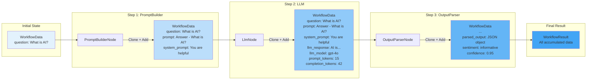
```mermaid
flowchart LR
    subgraph "Initial State"
        Input[WorkflowData<br/>question: What is AI?]
    end
    
    subgraph "Step 1: PromptBuilder"
        PB[PromptBuilderNode]
        PBData[WorkflowData<br/>question: What is AI?<br/>prompt: Answer - What is AI?<br/>system_prompt: You are helpful]
    end
    
    subgraph "Step 2: LLM"
        LLM[LlmNode]
        LLMData[WorkflowData<br/>question: What is AI?<br/>prompt: Answer - What is AI?<br/>system_prompt: You are helpful<br/>llm_response: AI is...<br/>llm_model: gpt-4o<br/>prompt_tokens: 15<br/>completion_tokens: 42]
    end
    
    subgraph "Step 3: OutputParser"
      Parser[OutputParserNode]
        ParsedData[WorkflowData<br/>...<br/>parsed_output: JSON object<br/>sentiment: informative<br/>confidence: 0.95]
    end
    
    subgraph "Final Result"
  Output[WorkflowResult<br/>All accumulated data]
  end
    
    Input --> PB
    PB -->|Clone + Add| PBData
    PBData --> LLM
    LLM -->|Clone + Add| LLMData
 LLMData --> Parser
    Parser -->|Clone + Add| ParsedData
    ParsedData --> Output
    
    style Input fill:#E3F2FD
    style PBData fill:#BBDEFB
    style LLMData fill:#90CAF9
    style ParsedData fill:#64B5F6
    style Output fill:#42A5F5
```

### WorkflowData vs WorkflowContext State

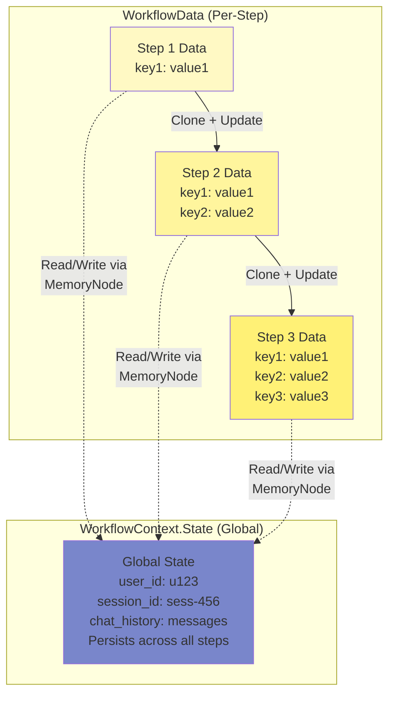
```mermaid
graph TB
    subgraph "WorkflowData (Per-Step)"
 WD1[Step 1 Data<br/>key1: value1]
    WD2[Step 2 Data<br/>key1: value1<br/>key2: value2]
        WD3[Step 3 Data<br/>key1: value1<br/>key2: value2<br/>key3: value3]
 end
    
    subgraph "WorkflowContext.State (Global)"
        GS[Global State<br/>user_id: u123<br/>session_id: sess-456<br/>chat_history: messages<br/>Persists across all steps]
    end
    
  WD1 -->|Clone + Update| WD2
    WD2 -->|Clone + Update| WD3
    
    WD1 -.->|Read/Write via<br/>MemoryNode| GS
    WD2 -.->|Read/Write via<br/>MemoryNode| GS
    WD3 -.->|Read/Write via<br/>MemoryNode| GS
    
    style WD1 fill:#FFF9C4
    style WD2 fill:#FFF59D
    style WD3 fill:#FFF176
style GS fill:#7986CB
```

---

## 6. Error Handling Flow

### Multi-Layer Error Handling

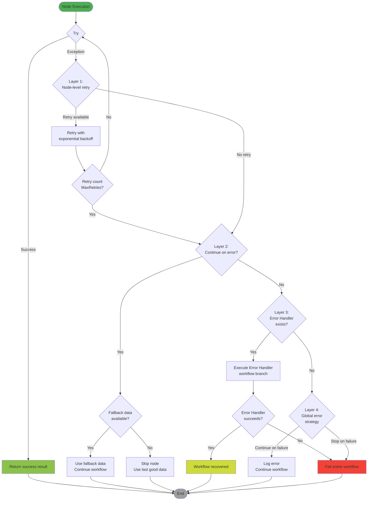
```mermaid
flowchart TD
    Start([Node Execution]) --> Try{Try}
    
    Try -->|Success| Success[Return success result]
    Try -->|Exception| Layer1{Layer 1:<br/>Node-level retry}
    
    Layer1 -->|Retry available| Retry[Retry with<br/>exponential backoff]
    Retry --> RetryCount{Retry count <br/> MaxRetries?}
    RetryCount -->|No| Try
    RetryCount -->|Yes| Layer2
    
    Layer1 -->|No retry| Layer2{Layer 2:<br/>Continue on error?}
    
    Layer2 -->|Yes| Fallback{Fallback data<br/>available?}
    Fallback -->|Yes| UseFallback[Use fallback data<br/>Continue workflow]
    Fallback -->|No| SkipNode[Skip node<br/>Use last good data]
    
    Layer2 -->|No| Layer3{Layer 3:<br/>Error Handler<br/>exists?}
    
    Layer3 -->|Yes| ErrorHandler[Execute Error Handler<br/>workflow branch]
    ErrorHandler --> ErrorHandlerSuccess{Error Handler<br/>succeeds?}
    ErrorHandlerSuccess -->|Yes| Recovered[Workflow recovered]
    ErrorHandlerSuccess -->|No| FailWorkflow
    
    Layer3 -->|No| Layer4{Layer 4:<br/>Global error<br/>strategy}
    
    Layer4 -->|Continue on failure| LogError[Log error<br/>Continue workflow]
  Layer4 -->|Stop on failure| FailWorkflow[Fail entire workflow]
    
    Success --> End([End])
    UseFallback --> End
    SkipNode --> End
    Recovered --> End
    LogError --> End
    FailWorkflow --> End
    
    style Start fill:#4CAF50
    style Success fill:#8BC34A
    style Recovered fill:#CDDC39
    style FailWorkflow fill:#F44336
    style End fill:#9E9E9E
```

### TryCatch Node Pattern

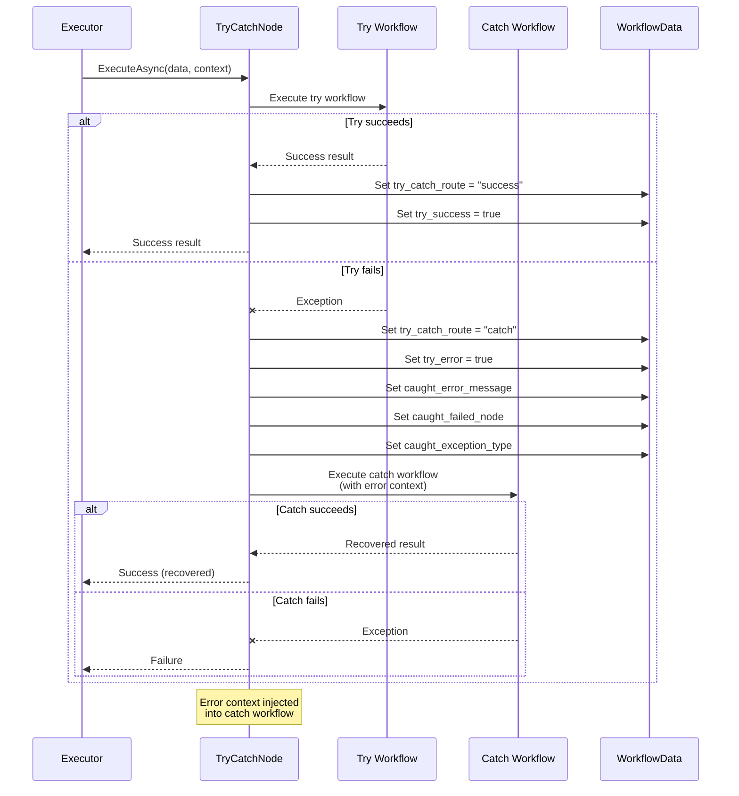
```mermaid
sequenceDiagram
    participant Executor
    participant TryCatch as TryCatchNode
 participant TryBranch as Try Workflow
    participant CatchBranch as Catch Workflow
    participant Data as WorkflowData
    
 Executor->>TryCatch: ExecuteAsync(data, context)
    
 TryCatch->>TryBranch: Execute try workflow
    
    alt Try succeeds
      TryBranch-->>TryCatch: Success result
        TryCatch->>Data: Set try_catch_route = "success"
        TryCatch->>Data: Set try_success = true
        TryCatch-->>Executor: Success result
 else Try fails
     TryBranch--xTryCatch: Exception
        TryCatch->>Data: Set try_catch_route = "catch"
      TryCatch->>Data: Set try_error = true
        TryCatch->>Data: Set caught_error_message
        TryCatch->>Data: Set caught_failed_node
        TryCatch->>Data: Set caught_exception_type
        
   TryCatch->>CatchBranch: Execute catch workflow<br/>(with error context)

        alt Catch succeeds
            CatchBranch-->>TryCatch: Recovered result
       TryCatch-->>Executor: Success (recovered)
    else Catch fails
    CatchBranch--xTryCatch: Exception
            TryCatch-->>Executor: Failure
        end
    end
    
    Note over TryCatch: Error context injected<br/>into catch workflow
```

---

## 7. Parallel Execution Flow

### Parallel Node Execution

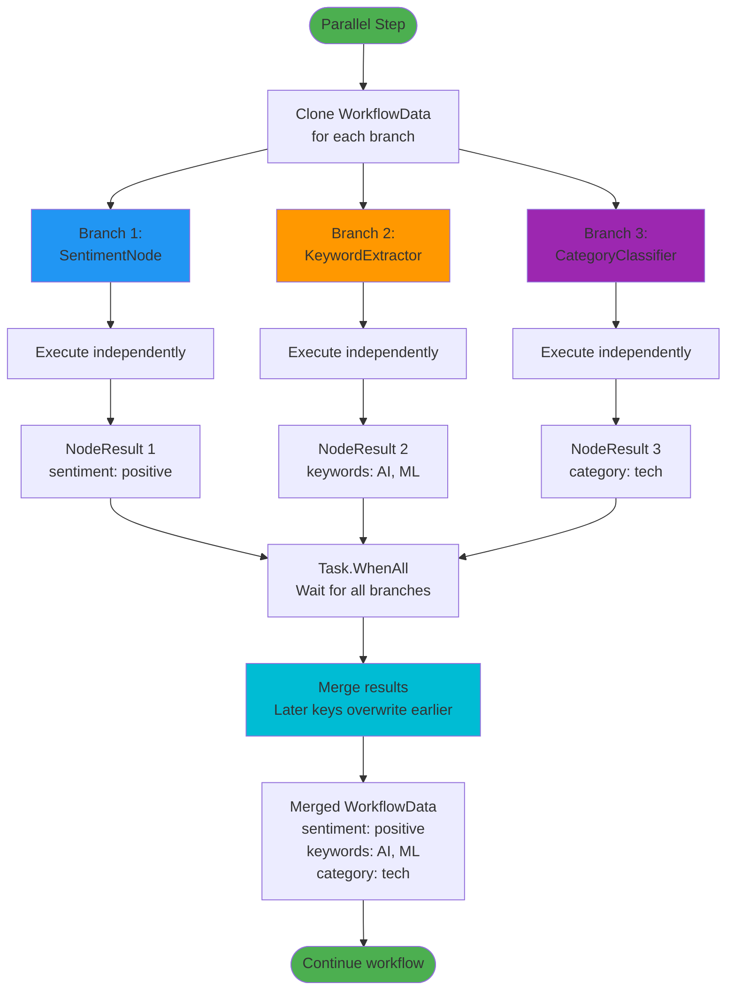
```mermaid
flowchart TD
    Start([Parallel Step]) --> CloneData[Clone WorkflowData<br/>for each branch]
    
    CloneData --> Branch1[Branch 1:<br/>SentimentNode]
    CloneData --> Branch2[Branch 2:<br/>KeywordExtractor]
    CloneData --> Branch3[Branch 3:<br/>CategoryClassifier]
    
    Branch1 --> Execute1[Execute independently]
    Branch2 --> Execute2[Execute independently]
    Branch3 --> Execute3[Execute independently]
    
    Execute1 --> Result1[NodeResult 1<br/>sentiment: positive]
    Execute2 --> Result2[NodeResult 2<br/>keywords: AI, ML]
    Execute3 --> Result3[NodeResult 3<br/>category: tech]
 
    Result1 --> WaitAll[Task.WhenAll<br/>Wait for all branches]
    Result2 --> WaitAll
    Result3 --> WaitAll
    
    WaitAll --> Merge[Merge results<br/>Later keys overwrite earlier]
 
    Merge --> MergedData[Merged WorkflowData<br/>sentiment: positive<br/>keywords: AI, ML<br/>category: tech]
 
    MergedData --> End([Continue workflow])

    style Start fill:#4CAF50
    style Branch1 fill:#2196F3
 style Branch2 fill:#FF9800
    style Branch3 fill:#9C27B0
    style Merge fill:#00BCD4
    style End fill:#4CAF50
```

### Parallel Execution Timeline

```mermaid
gantt
    title Parallel vs Sequential Execution
    dateFormat X
    axisFormat %Ls
    
    section Sequential
 SentimentNode     :0, 1000
    KeywordExtractor  :1000, 2000
    CategoryClassifier:2000, 3000
    
    section Parallel
    SentimentNode (P)     :0, 1000
    KeywordExtractor (P)  :0, 800
    CategoryClassifier (P):0, 1200
    Merge Results         :1200, 1250
```

---

## 8. Loop Execution Flow

### ForEach Loop Pattern

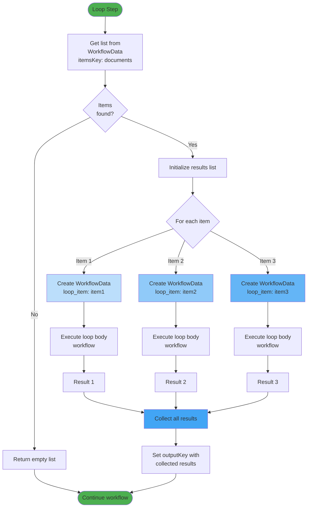
```mermaid
flowchart TD
    Start([Loop Step]) --> GetItems[Get list from<br/>WorkflowData<br/>itemsKey: documents]
    
    GetItems --> CheckItems{Items<br/>found?}
    CheckItems -->|No| Empty[Return empty list]
    CheckItems -->|Yes| InitResults[Initialize results list]
    
    InitResults --> LoopStart{For each item}
    
    LoopStart -->|Item 1| CreateContext1[Create WorkflowData<br/>loop_item: item1]
    LoopStart -->|Item 2| CreateContext2[Create WorkflowData<br/>loop_item: item2]
    LoopStart -->|Item 3| CreateContext3[Create WorkflowData<br/>loop_item: item3]
    
    CreateContext1 --> ExecuteBody1[Execute loop body<br/>workflow]
    CreateContext2 --> ExecuteBody2[Execute loop body<br/>workflow]
 CreateContext3 --> ExecuteBody3[Execute loop body<br/>workflow]
    
    ExecuteBody1 --> Result1[Result 1]
    ExecuteBody2 --> Result2[Result 2]
ExecuteBody3 --> Result3[Result 3]
    
    Result1 --> Collect[Collect all results]
    Result2 --> Collect
    Result3 --> Collect
    
    Collect --> SetOutput[Set outputKey with<br/>collected results]
    
 Empty --> End([Continue workflow])
    SetOutput --> End

    style Start fill:#4CAF50
    style CreateContext1 fill:#BBDEFB
    style CreateContext2 fill:#90CAF9
    style CreateContext3 fill:#64B5F6
    style Collect fill:#42A5F5
    style End fill:#4CAF50
```

### Loop Body Execution

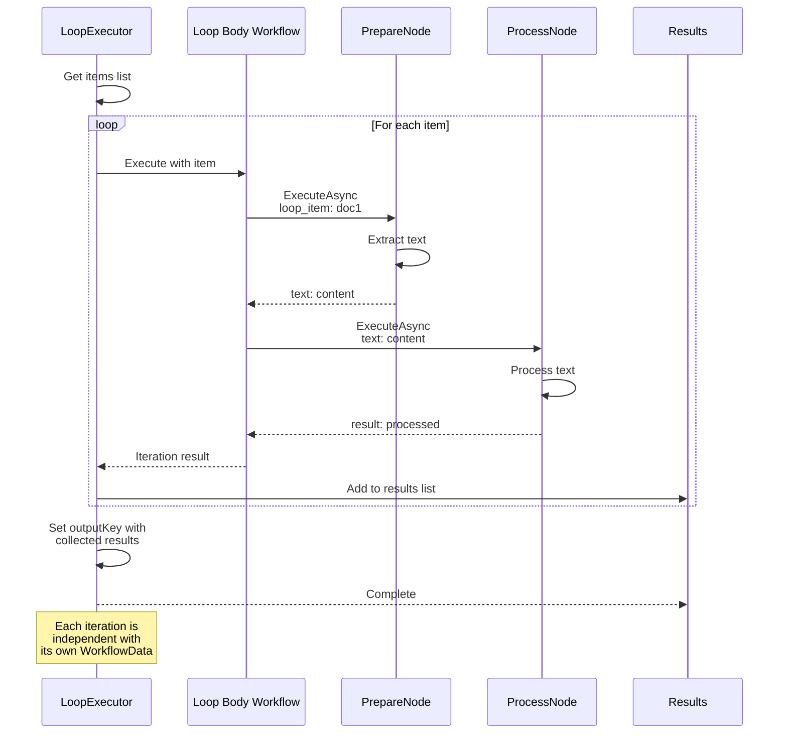
```mermaid
sequenceDiagram
    participant LoopExec as LoopExecutor
    participant Body as Loop Body Workflow
    participant Node1 as PrepareNode
    participant Node2 as ProcessNode
    participant Results
    
    LoopExec->>LoopExec: Get items list
    
    loop For each item
     LoopExec->>Body: Execute with item
        Body->>Node1: ExecuteAsync<br/>loop_item: doc1
        Node1->>Node1: Extract text
        Node1-->>Body: text: content
   
        Body->>Node2: ExecuteAsync<br/>text: content
        Node2->>Node2: Process text
   Node2-->>Body: result: processed
        
        Body-->>LoopExec: Iteration result
        LoopExec->>Results: Add to results list
    end
    
    LoopExec->>LoopExec: Set outputKey with<br/>collected results
    LoopExec-->>Results: Complete
    
    Note over LoopExec: Each iteration is<br/>independent with<br/>its own WorkflowData
```
---

## 9. Branch Execution Flow

### Conditional Branch (if/else)

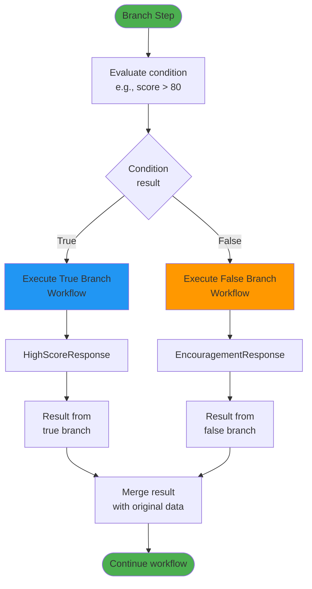
```mermaid
flowchart TD
    Start([Branch Step]) --> EvalCondition[Evaluate condition<br/>e.g., score > 80]
    
    EvalCondition --> CondResult{Condition<br/>result}
    
    CondResult -->|True| TrueBranch[Execute True Branch<br/>Workflow]
    CondResult -->|False| FalseBranch[Execute False Branch<br/>Workflow]
    
    TrueBranch --> TrueNodes[HighScoreResponse]
    FalseBranch --> FalseNodes[EncouragementResponse]
    
    TrueNodes --> TrueResult[Result from<br/>true branch]
    FalseNodes --> FalseResult[Result from<br/>false branch]
 
    TrueResult --> Merge[Merge result<br/>with original data]
    FalseResult --> Merge
    
    Merge --> End([Continue workflow])
    
    style Start fill:#4CAF50
    style TrueBranch fill:#2196F3
    style FalseBranch fill:#FF9800
    style End fill:#4CAF50
```

### Switch/Case Branch

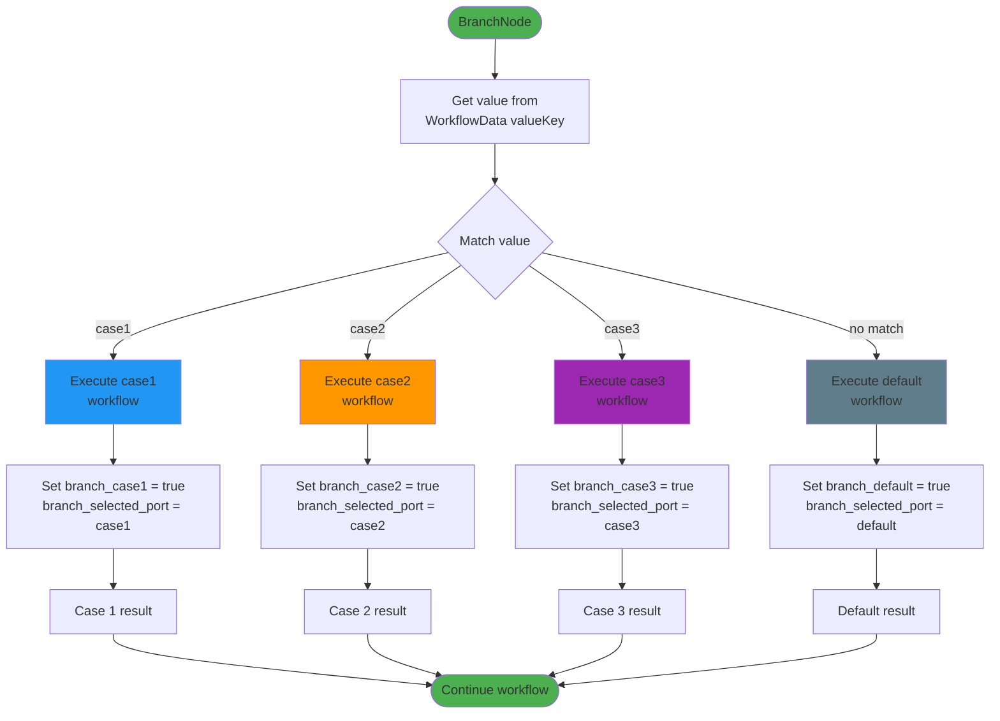
```mermaid
flowchart TD
    Start([BranchNode]) --> GetValue[Get value from<br/>WorkflowData valueKey]
    
    GetValue --> Match{Match value}
    
    Match -->|case1| Case1[Execute case1<br/>workflow]
    Match -->|case2| Case2[Execute case2<br/>workflow]
    Match -->|case3| Case3[Execute case3<br/>workflow]
    Match -->|no match| Default[Execute default<br/>workflow]
    
    Case1 --> SetFlags1[Set branch_case1 = true<br/>branch_selected_port = case1]
    Case2 --> SetFlags2[Set branch_case2 = true<br/>branch_selected_port = case2]
    Case3 --> SetFlags3[Set branch_case3 = true<br/>branch_selected_port = case3]
    Default --> SetFlags4[Set branch_default = true<br/>branch_selected_port = default]
    
    SetFlags1 --> Result1[Case 1 result]
    SetFlags2 --> Result2[Case 2 result]
    SetFlags3 --> Result3[Case 3 result]
    SetFlags4 --> Result4[Default result]
    
    Result1 --> End([Continue workflow])
    Result2 --> End
    Result3 --> End
    Result4 --> End
    
style Start fill:#4CAF50
    style Case1 fill:#2196F3
    style Case2 fill:#FF9800
    style Case3 fill:#9C27B0
    style Default fill:#607D8B
  style End fill:#4CAF50
```

---

## 10. LLM Integration Flow

### LLM Request/Response Flow

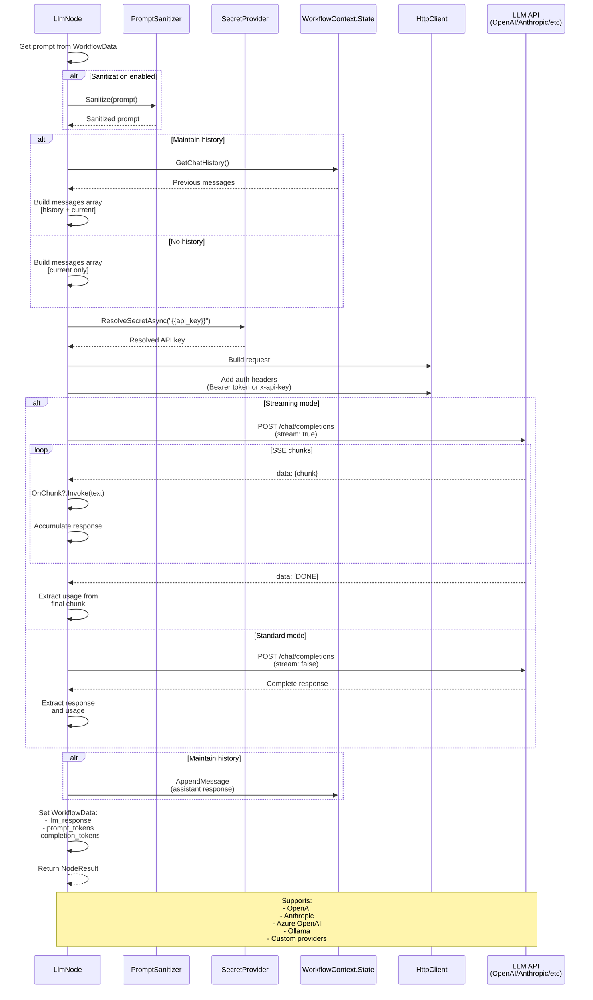
```mermaid
sequenceDiagram
    participant Node as LlmNode
    participant Sanitizer as PromptSanitizer
    participant Secret as SecretProvider
    participant History as WorkflowContext.State
    participant HTTP as HttpClient
    participant API as LLM API<br/>(OpenAI/Anthropic/etc)
    
 Node->>Node: Get prompt from WorkflowData
    
    alt Sanitization enabled
        Node->>Sanitizer: Sanitize(prompt)
        Sanitizer-->>Node: Sanitized prompt
    end
    
    alt Maintain history
        Node->>History: GetChatHistory()
    History-->>Node: Previous messages
        Node->>Node: Build messages array<br/>[history + current]
    else No history
        Node->>Node: Build messages array<br/>[current only]
    end
    
    Node->>Secret: ResolveSecretAsync("{{api_key}}")
    Secret-->>Node: Resolved API key
    
    Node->>HTTP: Build request
    Node->>HTTP: Add auth headers<br/>(Bearer token or x-api-key)
  
    alt Streaming mode
        Node->>API: POST /chat/completions<br/>(stream: true)
  
        loop SSE chunks
  API-->>Node: data: {chunk}
 Node->>Node: OnChunk?.Invoke(text)
    Node->>Node: Accumulate response
  end
        
        API-->>Node: data: [DONE]
        Node->>Node: Extract usage from<br/>final chunk
    else Standard mode
        Node->>API: POST /chat/completions<br/>(stream: false)
        API-->>Node: Complete response
        Node->>Node: Extract response<br/>and usage
    end
    
    alt Maintain history
        Node->>History: AppendMessage<br/>(assistant response)
    end
    
    Node->>Node: Set WorkflowData:<br/>- llm_response<br/>- prompt_tokens<br/>- completion_tokens
    
    Node-->>Node: Return NodeResult
    
    Note over Node,API: Supports:<br/>- OpenAI<br/>- Anthropic<br/>- Azure OpenAI<br/>- Ollama<br/>- Custom providers
```

### Streaming vs Non-Streaming

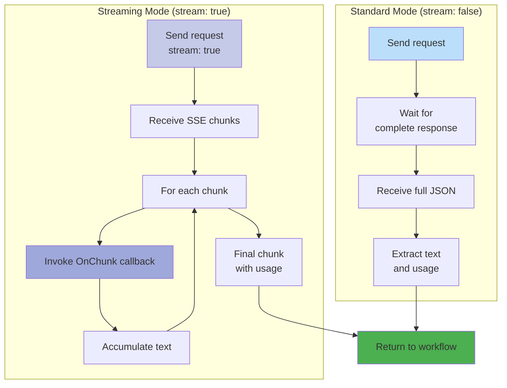
```mermaid
graph TB
    subgraph "Standard Mode (stream: false)"
        S1[Send request] --> S2[Wait for<br/>complete response]
        S2 --> S3[Receive full JSON]
        S3 --> S4[Extract text<br/>and usage]
    end
    
    subgraph "Streaming Mode (stream: true)"
        T1[Send request<br/>stream: true] --> T2[Receive SSE chunks]
        T2 --> T3[For each chunk]
        T3 --> T4[Invoke OnChunk callback]
  T4 --> T5[Accumulate text]
        T5 --> T3
        T3 --> T6[Final chunk<br/>with usage]
    end
    
    S4 --> Return[Return to workflow]
    T6 --> Return
    
    style S1 fill:#BBDEFB
    style T1 fill:#C5CAE9
    style T4 fill:#9FA8DA
    style Return fill:#4CAF50
```

---

## 11. RAG Pipeline Flow

### Complete RAG System

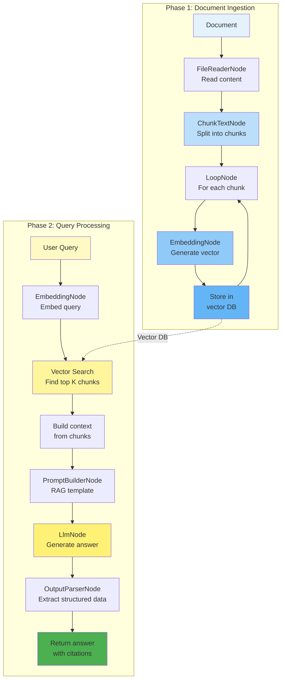
```mermaid
flowchart TD
    subgraph "Phase 1: Document Ingestion"
        Doc[Document] --> Read[FileReaderNode<br/>Read content]
        Read --> Chunk[ChunkTextNode<br/>Split into chunks]
        Chunk --> Loop[LoopNode<br/>For each chunk]
        
        Loop --> Embed[EmbeddingNode<br/>Generate vector]
     Embed --> Store[Store in<br/>vector DB]
        Store --> Loop
  end
    
    subgraph "Phase 2: Query Processing"
        Query[User Query] --> EmbedQ[EmbeddingNode<br/>Embed query]
 EmbedQ --> Search[Vector Search<br/>Find top K chunks]
        Search --> Context[Build context<br/>from chunks]
     Context --> BuildPrompt[PromptBuilderNode<br/>RAG template]
        BuildPrompt --> LLM[LlmNode<br/>Generate answer]
        LLM --> Parse[OutputParserNode<br/>Extract structured data]
Parse --> Response[Return answer<br/>with citations]
    end
    
    Store -.->|Vector DB| Search
    
    style Doc fill:#E3F2FD
    style Chunk fill:#BBDEFB
    style Embed fill:#90CAF9
    style Store fill:#64B5F6
    style Query fill:#FFF9C4
    style Search fill:#FFF59D
    style LLM fill:#FFF176
    style Response fill:#4CAF50
```

### RAG Query Execution Detail

```mermaid
sequenceDiagram
    participant User
    participant Query as QueryWorkflow
    participant Embed as EmbeddingNode
 participant VectorDB
    participant Prompt as PromptBuilderNode
    participant LLM as LlmNode
    participant Parser as OutputParserNode
  
    User->>Query: Query: "How to configure auth?"
    
    Query->>Embed: Embed query text
    Embed->>Embed: Call embedding API
    Embed-->>Query: query_embedding: float[1536]
    
    Query->>VectorDB: Vector search<br/>(top_k=5, min_score=0.7)
    VectorDB->>VectorDB: Cosine similarity
  VectorDB-->>Query: Top 5 chunks with scores
    
    Query->>Query: Format context:<br/>[Source 1] chunk1<br/>[Source 2] chunk2...
    
    Query->>Prompt: Build RAG prompt
    Prompt->>Prompt: Template:<br/>"Answer using ONLY this context:<br/>{{retrieved_context}}<br/>Question: {{query}}"
    Prompt-->>Query: Rendered prompt
    
    Query->>LLM: Generate answer
    LLM->>LLM: Call LLM API<br/>(low temperature for accuracy)
    LLM-->>Query: Response with citations
    
 Query->>Parser: Extract answer + metadata
    Parser-->>Query: Parsed result
    
    Query-->>User: Answer:<br/>"Configure auth by...<br/>[Source 1], [Source 2]"
    
    Note over Query,VectorDB: Semantic search finds<br/>relevant chunks even if<br/>query words differ
```

---

## 12. Retry Mechanism Flow

### Exponential Backoff Retry

```mermaid
flowchart TD
 Start([Execute Node]) --> Attempt1[Attempt 1]
    
    Attempt1 --> Success1{Success?}
    Success1 -->|Yes| Return[Return result]
    Success1 -->|No| CheckRetry1{Retries left?}
    
    CheckRetry1 -->|No| Fail[Return failure]
    CheckRetry1 -->|Yes| Wait1[Wait 1s<br/>delay x 2 power 0]

    Wait1 --> Attempt2[Attempt 2]
    Attempt2 --> Success2{Success?}
    Success2 -->|Yes| Return
    Success2 -->|No| CheckRetry2{Retries left?}
  
    CheckRetry2 -->|No| Fail
    CheckRetry2 -->|Yes| Wait2[Wait 2s<br/>delay x 2 power 1]
    
    Wait2 --> Attempt3[Attempt 3]
    Attempt3 --> Success3{Success?}
    Success3 -->|Yes| Return
    Success3 -->|No| CheckRetry3{Retries left?}
 
    CheckRetry3 -->|No| Fail
    CheckRetry3 -->|Yes| Wait3[Wait 4s<br/>delay x 2 power 2]
    
  Wait3 --> Attempt4[Attempt 4 final]
    Attempt4 --> Success4{Success?}
    Success4 -->|Yes| Return
    Success4 -->|No| Fail
  
  style Start fill:#4CAF50
    style Return fill:#8BC34A
    style Fail fill:#F44336
  style Wait1 fill:#FFF9C4
    style Wait2 fill:#FFF59D
    style Wait3 fill:#FFF176
```

### Retry Configuration Timeline

```mermaid
gantt
    title Retry Attempts with Exponential Backoff
    dateFormat X
    axisFormat %Ls
    
    section Attempts
    Attempt 1 fail    :0, 100
  Wait 1s :100, 1100
    Attempt 2 fail    :1100, 1200
    Wait 2s         :1200, 3200
    Attempt 3 fail    :3200, 3300
    Wait 4s       :3300, 7300
    Attempt 4 success :7300, 7400
```
---

## 13. State Management

### State Scopes

```mermaid
graph TB
    subgraph "Run-Scoped State"
        Context[WorkflowContext]
 RunId[RunId: guid]
   Logger[Logger]
        Tracker[ExecutionTracker]
        GlobalState[Global State<br/>Persists across all nodes]
        ChatHistory[Chat History]
    end
    
    subgraph "Step-Scoped Data"
        WD1[WorkflowData<br/>Step 1]
        WD2[WorkflowData<br/>Step 2]
        WD3[WorkflowData<br/>Step 3]
    end
    
    subgraph "Node-Scoped"
      NodeCtx1[NodeExecutionContext<br/>Node 1]
        NodeCtx2[NodeExecutionContext<br/>Node 2]
        NodeCtx3[NodeExecutionContext<br/>Node 3]
    end
    
    Context -.-> WD1
    Context -.-> WD2
    Context -.-> WD3
    
    WD1 --> NodeCtx1
    WD2 --> NodeCtx2
    WD3 --> NodeCtx3
    
  NodeCtx1 -.->|Read/Write| GlobalState
    NodeCtx2 -.->|Read/Write| GlobalState
    NodeCtx3 -.->|Read/Write| GlobalState
    
    NodeCtx1 -.->|Read/Write| ChatHistory
    NodeCtx2 -.->|Read/Write| ChatHistory
    NodeCtx3 -.->|Read/Write| ChatHistory
    
    style Context fill:#7986CB
    style GlobalState fill:#5C6BC0
    style WD1 fill:#FFF9C4
    style WD2 fill:#FFF59D
    style WD3 fill:#FFF176
    style NodeCtx1 fill:#C5CAE9
 style NodeCtx2 fill:#9FA8DA
    style NodeCtx3 fill:#7986CB
```

### Memory Node Pattern

```mermaid
sequenceDiagram
    participant Step1 as Step 1
    participant Memory1 as MemoryNode (Write)
    participant State as Global State
    participant Step2 as Step 2...N
    participant Memory2 as MemoryNode (Read)
    participant StepN as Step N
    
    Step1->>Step1: Process data<br/>user_id: "u123"<br/>session: "sess-456"
    
    Step1->>Memory1: ExecuteAsync(data)
    Memory1->>State: Write keys:<br/>user_id<br/>session
  State-->>Memory1: Stored
    
    Note over Step2: Multiple steps execute...<br/>WorkflowData cloned each time
    
    StepN->>Memory2: ExecuteAsync(data)
    Memory2->>State: Read keys:<br/>user_id<br/>session
    State-->>Memory2: user_id: "u123"<br/>session: "sess-456"
    Memory2->>StepN: Data updated with<br/>values from state
    
    Note over State: Global state persists<br/>across all nodes<br/>in the workflow run
```

---

## 14. Class Hierarchy

### Node Class Hierarchy

```mermaid
classDiagram
    class INode {
      <<interface>>
    +string Name
        +string Category
  +string Description
        +string IdPrefix
        +IReadOnlyList~NodeData~ DataIn
      +IReadOnlyList~NodeData~ DataOut
        +ExecuteAsync(data, context) NodeResult
    }
    
    class BaseNode {
      <<abstract>>
        +ExecuteAsync(data, context) NodeResult
        #RunAsync(data, context, nodeCtx)* WorkflowData
        -HandleTiming()
        -CatchExceptions()
        -CollectMetadata()
    }
    
    class SimpleTransformNode {
   <<abstract>>
        #string InputKey*
   #string OutputKey*
     #TransformAsync(input, context)* object
    }
    
    class LlmNode {
        -LlmConfig _config
        -IHttpClientProvider _httpProvider
        -ISecretProvider _secretProvider
        +ExecuteAsync(data, context) NodeResult
        -CallApiAsync()
     -StreamApiAsync()
    }
    
    class PromptBuilderNode {
     -string _promptTemplate
     -string _systemTemplate
        +ExecuteAsync(data, context) NodeResult
    -RenderTemplate()
    }
    
    class TransformNode {
        -Func _transform
        +ExecuteAsync(data, context) NodeResult
    }
    
    class FilterNode {
        -List~Condition~ _conditions
        +ExecuteAsync(data, context) NodeResult
        -ValidateConditions()
    }
    
    class HttpRequestNode {
        -HttpRequestConfig _config
      +ExecuteAsync(data, context) NodeResult
        -BuildRequest()
}
    
    INode <|.. BaseNode : implements
 BaseNode <|-- SimpleTransformNode : extends
    BaseNode <|-- LlmNode : extends
    BaseNode <|-- PromptBuilderNode : extends
    BaseNode <|-- TransformNode : extends
    BaseNode <|-- FilterNode : extends
    BaseNode <|-- HttpRequestNode : extends
    
 SimpleTransformNode <|-- UpperCaseNode : extends
  SimpleTransformNode <|-- LowerCaseNode : extends
```

### Workflow Builder Pattern

```mermaid
classDiagram
    class Workflow {
      -WorkflowBuilder _builder
        +Create(name)$ Workflow
        +AddNode(node) Workflow
        +Branch(condition, true, false) Workflow
        +Parallel(nodes) Workflow
        +ForEach(items, output, body) Workflow
        +RunAsync(data) WorkflowResult
    }
    
    class WorkflowBuilder {
        -string _name
        -List~PipelineStep~ _steps
        -ILogger _logger
        +Create(name)$ WorkflowBuilder
        +AddNode(node, options) WorkflowBuilder
        +Branch(condition, true, false) WorkflowBuilder
        +Parallel(nodes) WorkflowBuilder
        +ForEach(items, output, body) WorkflowBuilder
  +Build() WorkflowStructure
        +RunAsync(data) WorkflowResult
    }
    
    class WorkflowStructure {
        +string Name
  +IReadOnlyList~PipelineStep~ Steps
        +WorkflowConfiguration Config
    }
    
    class WorkflowExecutor {
        +ExecuteAsync(structure, data, context) WorkflowResult
 -ExecuteStepAsync(step, data, context)
    }
    
    class IStepExecutor {
        <<interface>>
        +ExecuteAsync(step, data, context) StepExecutionResult
    }
    
    class NodeStepExecutor {
        +ExecuteAsync(step, data, context) StepExecutionResult
    }
    
    class BranchStepExecutor {
        +ExecuteAsync(step, data, context) StepExecutionResult
    }
    
    class ParallelStepExecutor {
        +ExecuteAsync(step, data, context) StepExecutionResult
}

    class LoopStepExecutor {
        +ExecuteAsync(step, data, context) StepExecutionResult
    }
    
    Workflow --> WorkflowBuilder : uses
    WorkflowBuilder --> WorkflowStructure : builds
    WorkflowExecutor --> WorkflowStructure : executes
    WorkflowExecutor --> IStepExecutor : delegates to
    IStepExecutor <|.. NodeStepExecutor : implements
    IStepExecutor <|.. BranchStepExecutor : implements
 IStepExecutor <|.. ParallelStepExecutor : implements
    IStepExecutor <|.. LoopStepExecutor : implements
```

### Value Objects

```mermaid
classDiagram
    class Temperature {
        <<value object>>
        -float _value
        +FromValue(value)$ Temperature
        +Deterministic$ Temperature
    +Balanced$ Temperature
        +Creative$ Temperature
  +implicit operator float()
     +Validate(value)
    }
    
    class TokenCount {
     <<value object>>
        -int _value
        +FromValue(value)$ TokenCount
  +implicit operator int()
      +Validate(value)
    }
    
    class ChunkSize {
     <<value object>>
        -int _value
   +FromValue(value)$ ChunkSize
      +implicit operator int()
        +Validate(value)
    }
    
    class ChunkOverlap {
      <<value object>>
        -int _value
  +FromValue(value)$ ChunkOverlap
        +implicit operator int()
        +Validate(value)
    }
    
    class LlmConfig {
        +LlmProvider Provider
        +string Model
        +string ApiKey
    +Temperature Temperature
        +TokenCount MaxTokens
    +OpenAI(key, model)$ LlmConfig
        +Anthropic(key, model)$ LlmConfig
        +Ollama(model, host)$ LlmConfig
    }
    
    LlmConfig --> Temperature : uses
    LlmConfig --> TokenCount : uses
```

---

## Summary

This document provides comprehensive visual representations of the TwfAiFramework system using Mermaid diagrams:

? **Architecture** - High-level system design and layer responsibilities  
? **Request Flow** - API to workflow execution paths  
? **Execution Flow** - Complete pipeline execution with all step types  
? **Node Lifecycle** - Template method pattern and retry logic  
? **Data Flow** - WorkflowData transformation through pipeline  
? **Error Handling** - Multi-layer error recovery strategies  
? **Parallel Execution** - Concurrent branch processing  
? **Loop Execution** - ForEach pattern and iteration  
? **Branch Execution** - Conditional and switch/case routing  
? **LLM Integration** - Request/response flow with streaming  
? **RAG Pipeline** - Complete retrieval-augmented generation system  
? **Retry Mechanism** - Exponential backoff implementation  
? **State Management** - Scoped state and memory patterns  
? **Class Hierarchy** - Object-oriented design structure  

All diagrams are rendered using **Mermaid**, which is supported by:
- GitHub (README.md, documentation)
- Visual Studio Code (with Mermaid extension)
- Many documentation platforms (GitBook, Docusaurus, etc.)

To view these diagrams, simply open this file in any Mermaid-compatible viewer or platform.
